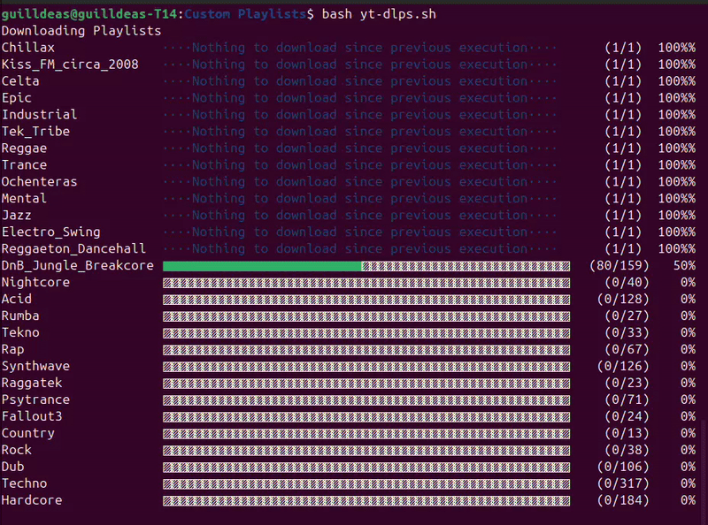

# yt-dlps

yt-dlp is a great open source tool developed to download YouTube playlists. This project is simply a bash wrapper to this tool that allows the user to automate many actions related to keeping and updating a media library:
- Download multiple playlists at once
- Sorting tracks into folders
- Encoding tracks with music genre metadata
- Monitoring the progress in a minimal CLI
- Speeding up subsequent runs by avoiding downloads of non updated playlists.

## Requirements

- Bash 4.3+
- yt-dlp
- FFmpeg
- jq
- Firefox

## Use

After cloning the repo and downloading dependencies update `Utils/lists_info.json` with your corresponding list of playlists genres and URLs to those playlists, make sure to spell the genres without whitespaces and paste the playlist URL, not the first video in the playlist, finally run `bash yt-dlp.sh`. To trouleshoot pass `bash yt-dlps.sh "True"` and read the captured yt-dlp output. 
